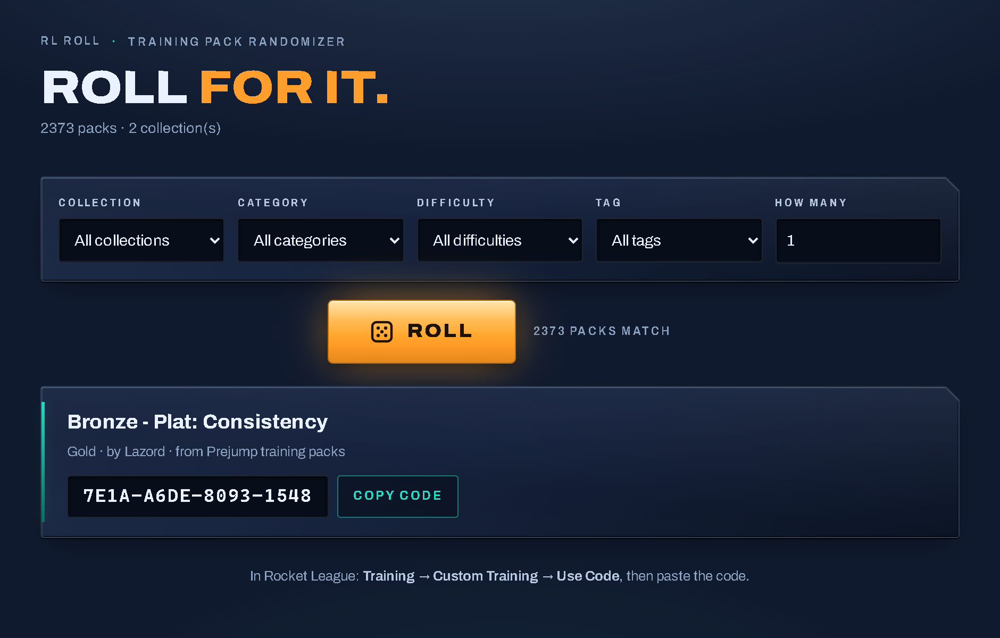

# RL Training Randomizer

[](https://github.com/HilsenFar/rl-training-randomizer/releases)
[](https://github.com/HilsenFar/rl-training-randomizer/releases/latest)

Can't decide what to practice? Roll a random **Rocket League** training pack.
Filter by category, difficulty, tag, creator or rating — or just hit the button.

**Try it in your browser:** [roll.gitato.net/app](https://roll.gitato.net/app/) —
the same roller, hosted, nothing to install. The download below adds the console
tools and the Prejump scraper.

It's built around a simple idea: **collections are just JSON files in a folder.**
Drop a new file in `collections/` and its packs join the pool. There's also a
built-in **scraper** that pulls thousands of packs from Prejump's public
database into a collection for you.



Two ways to use it — a web page and a command line — both reading the same
collections.

```
bin/randomize.mjs   command-line roller
bin/serve.mjs       serves the web UI
bin/scrape.mjs      builds a collection from Prejump
lib/catalog.mjs     loads + merges every collection in collections/
lib/pick.mjs        filtering + random selection
collections/        <-- drop your own .json files here (see collections/README.md)
public/             the web UI
```

## Use it (the easy way)

Download the latest release zip from the [Releases page](../../releases), unzip
it, then:

- **`start.cmd`** — opens the web UI in your browser. Pick filters, hit **Roll**,
  click **Copy code**, paste it into Rocket League.
- **`roll.cmd`** — rolls a pack in a console window (`roll.cmd --n 3 --category aerials`).
- **`scrape.cmd`** — adds ~2,300 more packs from Prejump (needs internet).

The release bundles its own Node runtime, so there's nothing to install.

## Use it from source

Requires **Node ≥ 18**. No dependencies.

```bash
node bin/randomize.mjs --n 3 --category aerials     # roll on the command line
node bin/serve.mjs                                  # web UI at http://127.0.0.1:8343
node bin/scrape.mjs                                 # add collections/prejump.json
node --test                                         # run the tests
```

### Command-line options

```
-n, --count <n>        how many to roll (default 1)
-c, --collection <s>   only from collections matching <s>
    --category <s>     only packs whose category matches <s>
-d, --difficulty <s>   only packs whose difficulty matches <s>
-t, --tag <s>          only packs with a matching tag
    --creator <s>      only packs by a matching creator
-s, --search <s>       match name / notes / creator / tags
    --min-rating <n>   only packs rated >= n
    --weighted         weight the draw by rating
    --seed <n>         repeatable roll
    --list-collections / --list-categories
```

## Adding your own packs

Make a file like `collections/my-packs.json`:

```json
{
  "name": "My warmup routine",
  "packs": [
    { "name": "The Ultimate Warmup", "code": "FA24-B2B7-2E8E-193B", "category": "MIXED" },
    { "name": "Powershots", "code": "7028-5E10-88EF-E83E", "category": "SHOOTING", "difficulty": "Gold" }
  ]
}
```

Only `name` and `code` are required. The full format — and the field aliases the
loader accepts — is in [`collections/README.md`](collections/README.md).

## The scraper

`bin/scrape.mjs` reads [Prejump](https://prejump.com/training-packs)'s public
training-pack database (an Inertia.js site) page by page and writes it as a
collection. It reads the site's current asset version from the page first and
re-reads it if the server rotates it mid-run, so it keeps working when the site
updates.

```bash
node bin/scrape.mjs                    # all packs -> collections/prejump.json
node bin/scrape.mjs --max-pages 5      # just a sample
node bin/scrape.mjs --sort newest      # most_popular (default) | newest | likes
node bin/scrape.mjs --out collections/prejump.json
```

Training pack codes are public and meant to be shared and pasted into the game;
the scraper just collects them, and the resulting collection credits Prejump as
its source.

## The website

[roll.gitato.net](https://roll.gitato.net/) is served from this repo's `docs/`
folder. The hosted roller at `/app/` is generated: `node bin/build-site.mjs`
bakes the collections and the web UI into `docs/app/`. Re-run it after changing
`public/` or `collections/`, then commit the result.

## License

[PolyForm Noncommercial 1.0.0](LICENSE) — free for non-commercial use and
modification. Pack data belongs to its original creators and sources.
